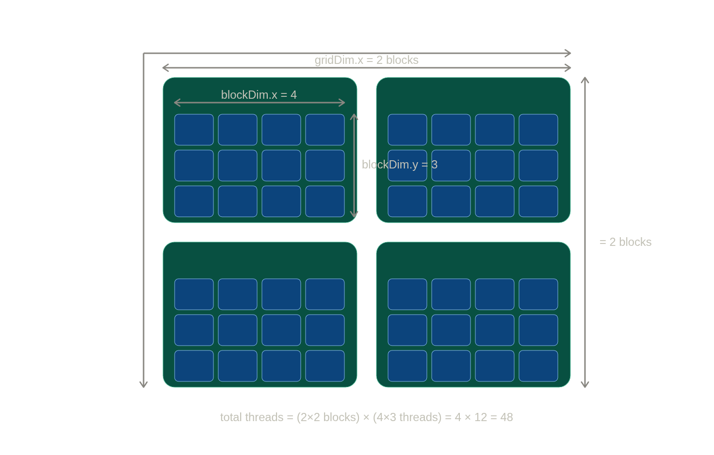
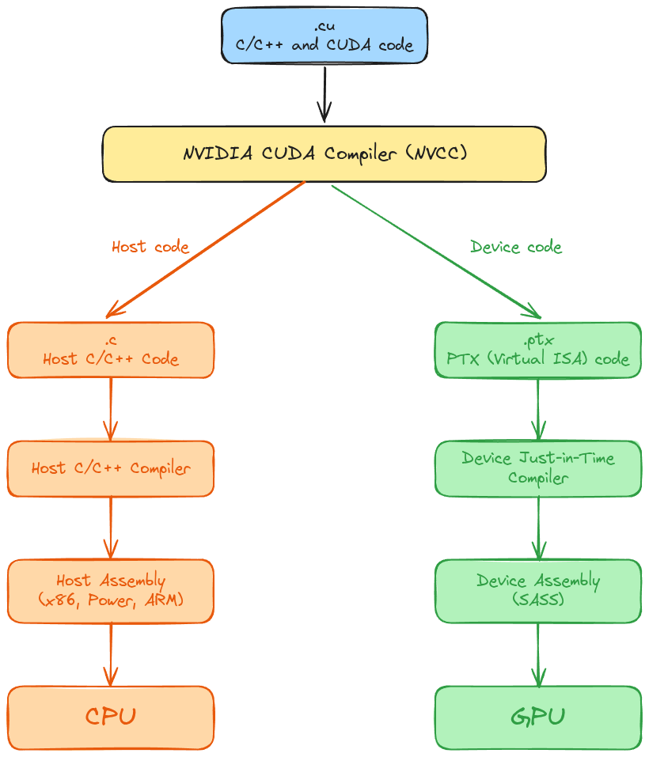
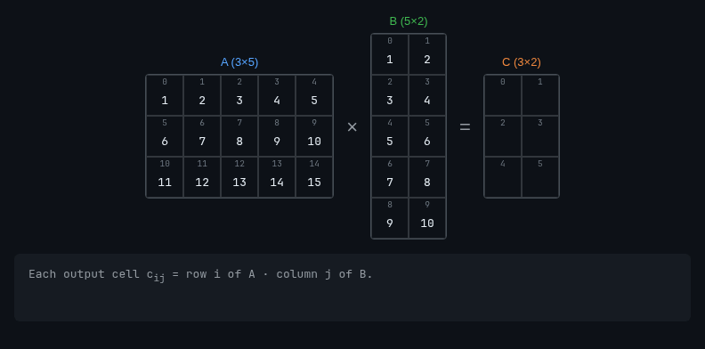
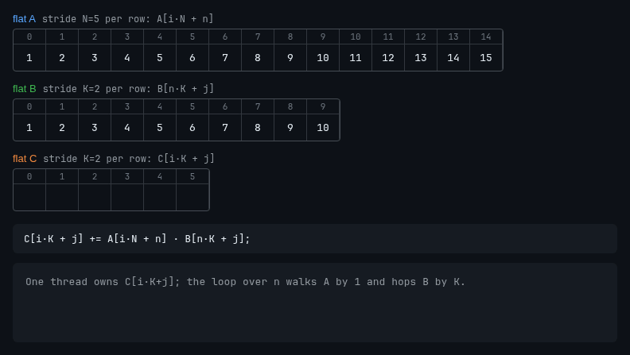

# 100 days of CUDA challenge

This is a 100-day challenge to master CUDA:

- https://github.com/hkproj/100-days-of-gpu/blob/main/CUDA.md

## Progress 

### Day 1

- learned that:
  - CUDA stands for **C**ompute **U**nified **D**evice **A**rchitecture.
  - the CUDA compiler is called NVCC (**N**VIDIA **C**UDA **C**ompiler).
  - CUDA is a platform with different levels of abstraction, either by language (e.g. python, c++, ptx) or by libraries. NVIDIA has put a ton of work into developing libraries to make developers' lives easier, for example:
    - **cuBLAS** linear algebra
    - **cuFFT** fast fourier transform
    - **cuDNN** neural networks
    - **cuRAND** random numbers

- found the NVIDIA [accelerated-computing-hub](https://github.com/NVIDIA/accelerated-computing-hub/tree/main) resource, plenty of courses to choose from, thinking of doing the Python ones.

- watched the video [What's CUDA All About Anyway?](https://www.nvidia.com/en-us/on-demand/session/gtc25-S72571/), a really great introduction to CUDA.

- created my first two CUDA kernels:
  - [hello_cuda.cu](day01/hello_cuda.cu)
  - [vector_addition.cu](day01/vector_addition.cu)


### Day 2

- learned about the CUDA execution hierarchy: grid -> block -> thread:
  

  ```c
  // blockDim.x = 4, blockDim.y = 3  → 12 threads per block
  dim3 block(4, 3);  
  // gridDim.x  = 2, gridDim.y  = 2  → 4 blocks 
  dim3 grid(2, 2);    
  // 48 threads total
  kernel<<<grid, block>>>();   
  ```

  ```c
  // 0 .. 7
  int col = blockIdx.x * blockDim.x + threadIdx.x;   
  // 0 .. 5
  int row = blockIdx.y * blockDim.y + threadIdx.y;   
  // 0 .. 47, unique
  // gridDim.x * blockDim.x is the total grid width in threads (8 here)
  int index = row * (gridDim.x * blockDim.x) + col; 
  ```

- grid limits in all three dimensions: 
x <= 2^32-1, y <= 65535, z <= 65535, if you do the math that is about 18.9 sextillion threads in total. which is pretty crazy number when you think about it... practical speaking in an RTX 5090 the max number of threads running at once is given by Num. SMs x 2048 around 348,160 threads, so is not like you can run all those threads :) 

- also block size limits in all three dimensions is as follow: x <= 1024, y <= 1024, z <= 64. important that x * y * z <= 1024, so the max number of threads per block is cap to 1024.

- looked into how CUDA compilation works: it separates the program into host and device paths.


- solved my first easy problem on LeetGPU, a matrix transpose kernel, hmm starting to understand the indices joggling of CUDA:
  - [matrix_transpose.cu](day01/matrix_transpose.cu)


### Day 3

- solved another "easy" LeetGPU problem, puff... this took longer than expected, in the sequential matrix multiplication there are three nested loops, it's actually a straightforward task, but in CUDA the two outer loops are handed over to the threads, leaving only the inner dot-product loop, another thing that makes the implementation challenging is the array flattening thing, it's really easy to mess that up, i guess it gets better with practice.

  

  *Matrix multiplication: row of A · column of B.*

  

  *Same thing with flattened arrays.*

