# 100 days of CUDA challenge

This is a 100-day challenge to master CUDA:

- https://github.com/hkproj/100-days-of-gpu/blob/main/CUDA.md

## Progress 

### Day 1

- learned that:
  - CUDA stands for **C**ompute **U**nified **D**evice **A**rchitecture.
  - the CUDA compiler is called NVCC (**N**VIDIA **C**UDA **C**ompiler).
  - CUDA is a platform with different levels of abstraction, either by language (e.g. python, c++, ptx) or by libraries. NVIDIA has put a ton of work into developing libraries to make developers' lives easier, for example:
    - **cuBLAS** linear algebra
    - **cuFFT** fast fourier transform
    - **cuDNN** neural networks
    - **cuRAND** random numbers

- found the NVIDIA [accelerated-computing-hub](https://github.com/NVIDIA/accelerated-computing-hub/tree/main) resource, plenty of courses to choose from, thinking of doing the Python ones.

- watched the video [What's CUDA All About Anyway?](https://www.nvidia.com/en-us/on-demand/session/gtc25-S72571/), a really great introduction to CUDA.

- created my first two CUDA kernels:
  - [hello_cuda.cu](day01/hello_cuda.cu)
  - [vector_addition.cu](day01/vector_addition.cu)


### Day 2

- learned about the CUDA execution hierarchy: grid -> block -> thread:
  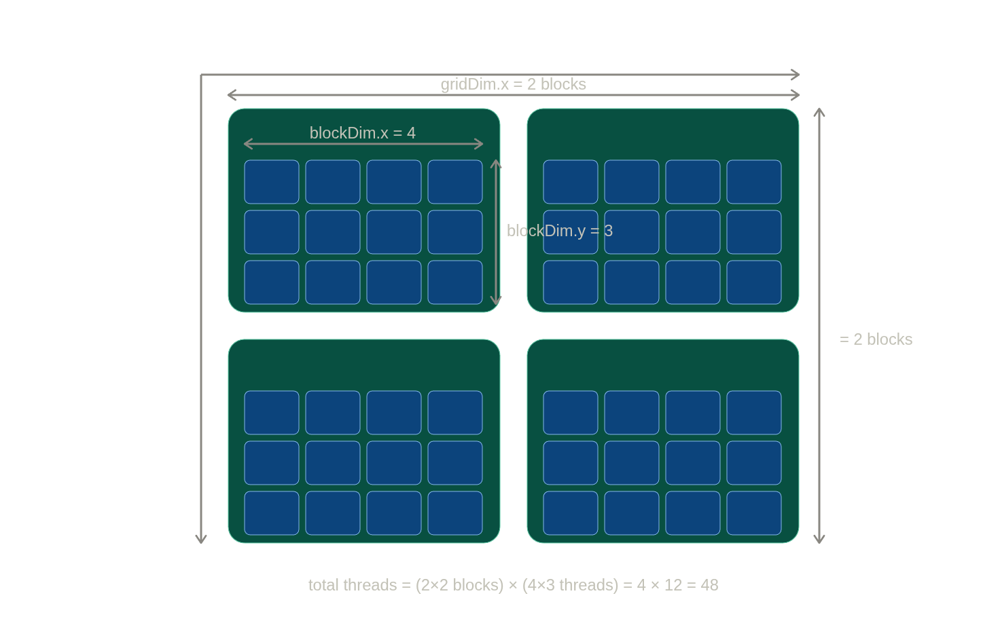

  ```c
  // blockDim.x = 4, blockDim.y = 3  → 12 threads per block
  dim3 block(4, 3);  
  // gridDim.x  = 2, gridDim.y  = 2  → 4 blocks 
  dim3 grid(2, 2);    
  // 48 threads total
  kernel<<<grid, block>>>();   
  ```

  ```c
  // 0 .. 7
  int col = blockIdx.x * blockDim.x + threadIdx.x;   
  // 0 .. 5
  int row = blockIdx.y * blockDim.y + threadIdx.y;   
  // 0 .. 47, unique
  // gridDim.x * blockDim.x is the total grid width in threads (8 here)
  int index = row * (gridDim.x * blockDim.x) + col; 
  ```

- grid limits in all three dimensions: 
x <= 2^32-1, y <= 65535, z <= 65535, if you do the math that is about 18.9 sextillion threads in total. which is pretty crazy number when you think about it... practical speaking in an RTX 5090 the max number of threads running at once is given by Num. SMs x 2048 around 348,160 threads, so is not like you can run all those threads :) 

- also block size limits in all three dimensions is as follow: x <= 1024, y <= 1024, z <= 64. important that x * y * z <= 1024, so the max number of threads per block is cap to 1024.

- looked into how CUDA compilation works: it separates the program into host and device paths.
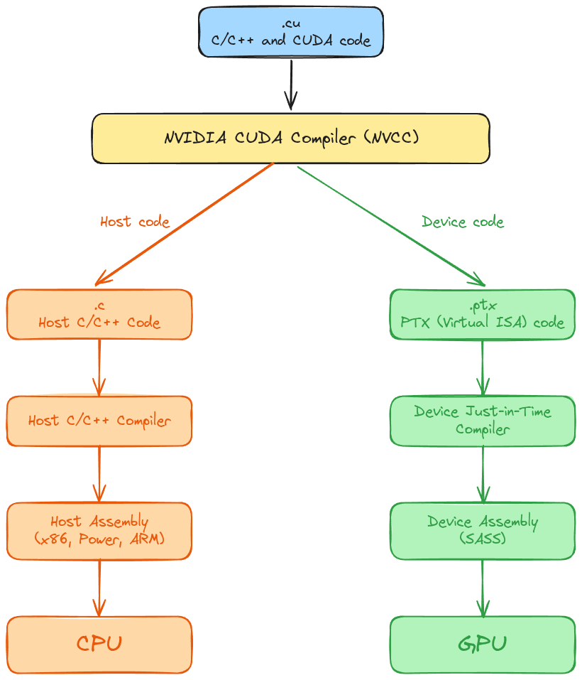

- solved my first easy problem on LeetGPU, a matrix transpose kernel, hmm starting to understand the indices joggling of CUDA:
  - [matrix_transpose.cu](day01/matrix_transpose.cu)


### Day 3

- solved another easy LeetGPU problem, matmul, this one took longer than expected. the sequential version has three nested loops, in CUDA the two outer loops go to the threads, leaving only the inner dot-product loop. the tricky part is the array flattening part, really easy to mess up, i guess it gets better with practice.

  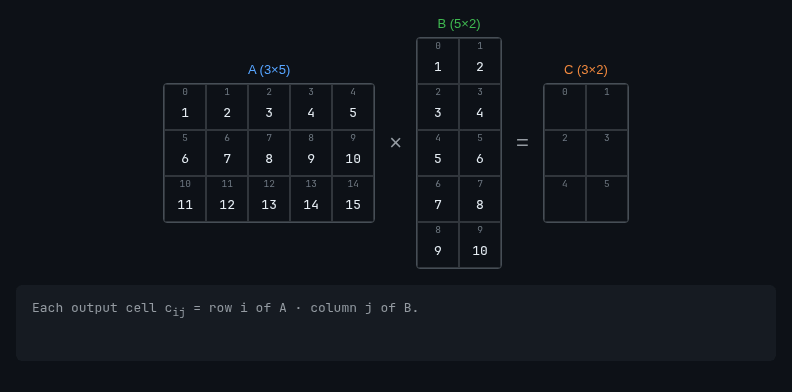

  *Matrix multiplication: row of A · column of B.*

  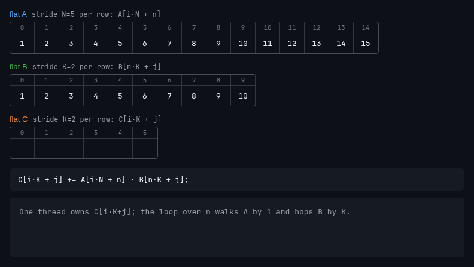

  *Same thing with flattened arrays.*

- since my matmul implementation is quite naive, i got curious about how this is done efficiently.  i found this great article, more fun for later :) 
  - https://siboehm.com/articles/22/CUDA-MMM

- ran across Flynn's taxonomy, nice for perspective, i knew SIMD from CPU land but never the full taxonomy: 
  - https://en.wikipedia.org/wiki/Flynn%27s_taxonomy

- also learned how the CUDA software model maps onto the actual hardware, nice mental model to keep in mind:

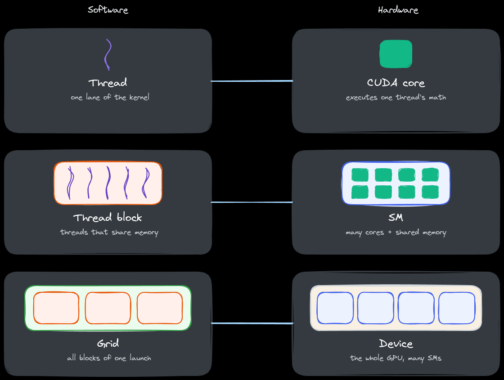

### Day 4

- learned a bit about warps:
  - the hardware splits each CUDA block into warps of 32 threads.
  - a warp is always (at least until now) 32 threads, even a block with a single thread takes up a full warp.
  - resources like shared memory are allocated per warp, not per thread.
  - all 32 threads execute the same instruction together at the same time, so if a conditional (like `if`) splits them into different paths, each path runs one after the other, that's warp divergence, and it's slow and not cool...

- solved three LeetGPU problems: [Color Inversion](day04/invert_rgb.cu), [RGB to Grayscale](day04/rgb_to_grayscale.cu) and [Reverse Array](day04/reverse_array.cu).

- the problems were mostly image transformations tasks. the images were given as a flatten array, for both problems once you extract the indices as follow, the calculations were easy.

  ```
  int channels = 4;
  int pixel = blockDim.x * blockIdx.x + threadIdx.x;
  if (pixel < width * height) {
    int idx = pixel * channels;
    ...
  }
  ```

- watched the video Unlocking GPU Performance with CUDA Tile:
  - highly recommended, really insightful Q&A session.
  - in short with cuTile we can program on tiles of data, the compiler handles the threads for you.
  - this is different than traditional SIMT, where the developer is in charge of the threads.
  - https://www.youtube.com/watch?v=uiIdk61UxEs
 

### Day 5

- optimized the LeetGPU problem matrix add with `float4` each thread now reads and writes 4 floats at once, so 4x fewer memory instructions 
  - [matrix_add_vec4.cu](day05/matrix_add_vec4.cu)

- solved the LeetGPU problems [1D Convolution](day05/convolution_1d.cu), [ReLU](day05/relu.cu) and [Leaky ReLU](day05/leaky_relu.cu).

- continued learning about warps:

- learned about branch efficiency, a simple metric for measuring warp divergence:

  ```
  branch efficiency = (num. branches - num. divergent branches) / (num. branches)
  ```
- during execution, warps pass through different states in the SM:
  - **active**: assigned to the SM, registers and memory allocated
  - **selected**: actively executing instructions
  - **stalled**: not ready to execute, waiting on something (memory load, barrier, etc.)
  - **eligible**: ready to execute, waiting for the scheduler

- here is the SM warp scheduler in action:

  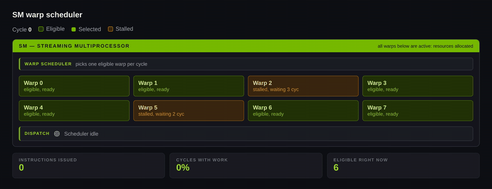

- read a bit about latency:

  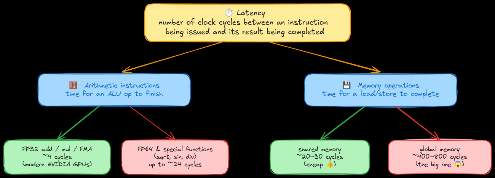

### Day 06

- solved the LeetGPU problems: [Rainbow Table](day06/rainbow_table.cu), [Copy Matrix](day06/copy_matrix.cu), [SiLU](day06/silu.cu), [SwiGLU](day06/swiglu.cu), [Value Clipping](day06/value_clipping.cu) and [Interleave Arrays](day06/interleave.cu). nearly done with all the easy problems. 

- did a few variants of [Copy Matrix](day06/copy_matrix_2.cu) and [Interleave Arrays](day06/interleave_2.cu) with vectorized loads/stores (`float4`, `float2`) to reduce the number of memory instructions.

- learned about the GPU memory hierarchy and the relative latency of each level. here is what it looks like on an H100:

  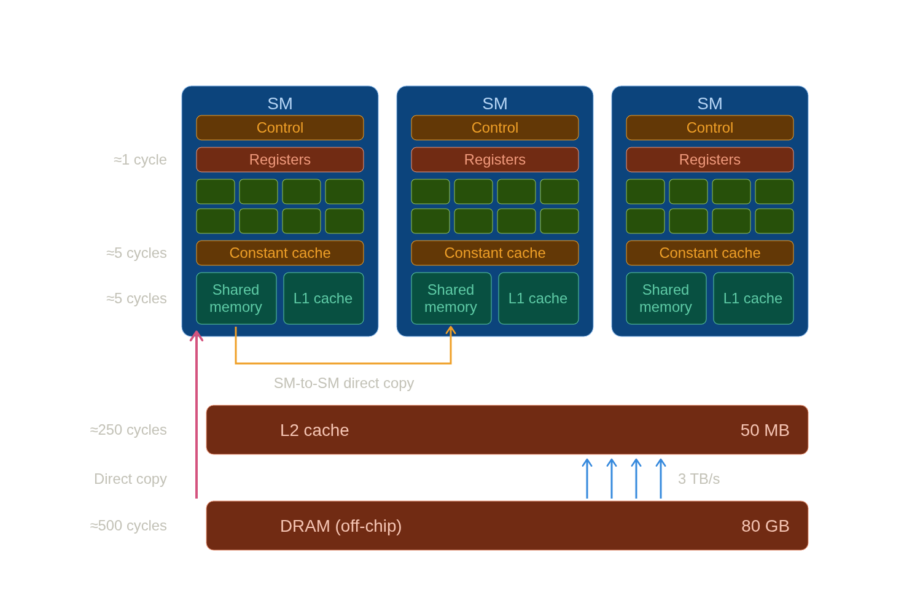

  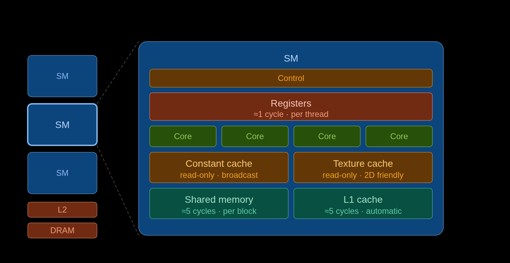

- watched the video "Interview with NVIDIA CUDA Architect Stephen Jones", thanks to the youtube algorithm for this one. it's an informal discussion about CUDA, really helpful!

  - https://www.youtube.com/watch?v=dNUMNifgExs

- finally got the 5th Edition of Programming Massively Parallel Processors! took some time to deliver since it was not available on amazon.de and had to be ordered from the US. in the coming days i will go through the chapters and share my learnings:

  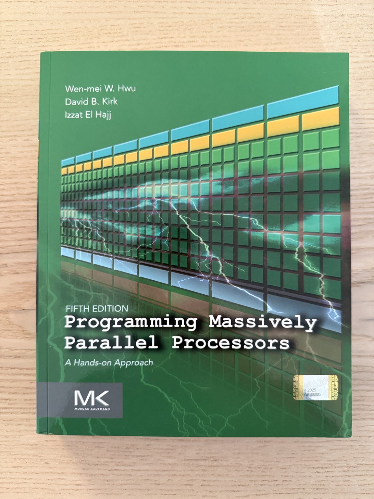

### Day 07

- solved the LeetGPU problems: [GEGLU](day07/geglu.cu) and [Sigmoid](day07/sigmoid.cu). with this, all the LeetGPU easy problems are done! :)

- half way through the first chapter of Programming Massively Parallel Processors, taking notes along the way and will post them once i'm done. the book also has a youtube channel, worth a look:

  - https://www.youtube.com/@pmpp-book

- ran into the course "Heterogeneous Parallel Programming" by Prof. Wen-mei Hwu, one of the authors of the book. thinking of using it as supplementary material:

  - https://www.youtube.com/watch?v=kZy4JD8Z6KA&list=PLzn6LN6WhlN06hIOA_ge6SrgdeSiuf9Tb&index=1


### Day 08

- solved my first LeetGPU medium problem: [Reduction](day08/reduce.cu). this was a nice one, until now i was only doing transformations, where the output has the same number of elements as the input. reductions are a bit more tricky, all the threads have to cooperate to produce a single value. first time i actually needed `__shared__`, `__syncthreads()` and `atomicAdd`, here is an animation how the process actually looks:

  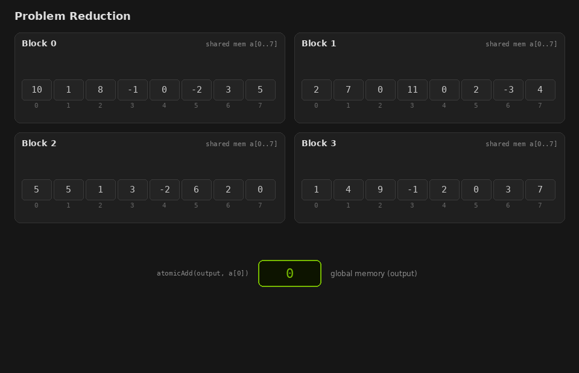

- finished chapter 1 of Programming Massively Parallel Processors, my notes are here: [chapter 1](docs/programming-massively-parallel-processors/chapter-1.md)

- found another really nice CUDA course by Bob Crovella from NVIDIA, the explanations are excellent:

  - https://www.youtube.com/watch?v=OsK8YFHTtNs&list=PL6RdenZrxrw-zNX7uuGppWETdxt_JxdMj&index=1

### Day 09

- solved two more LeetGPU medium problems: [Dot Product](day09/dot_product.cu) and [Softmax](day09/softmax.cu).

- dot product was basically yesterday's Reduction problem again. 

- the softmax one was more interesting, i ended up using three kernels: global max (for avoiding overflow), sum of `exp(x - max)`, then the final calculation. 

  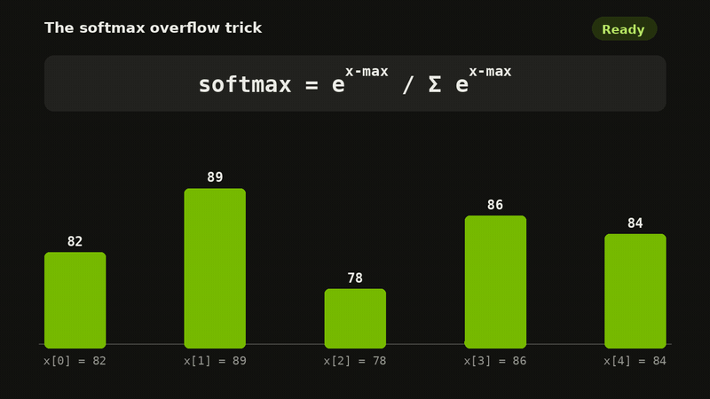

- til: there's no `atomicMax` for floats, had to hack around it with `atomicCAS`, pretty ugly stuff... need to re-do the softmax at some point.

- started chapter 2 of Programming Massively Parallel Processors, should finish it tomorrow.

### Day 10

- solved two more LeetGPU medium problems: [Count Array Element](day10/count_array_element.cu) and [Mean Squared Error](day10/mse.cu). both are variations of the Reduction problem from day 8, this pattern is used in many problems. 

- finished chapter 2 of Programming Massively Parallel Processors.

### Day 11

- solved three more LeetGPU medium problems: [2D Convolution](day11/conv_2d.cu), [Gaussian Blur](day11/gaussian_blur.cu) and [Jacobi Stencil](day11/jacobi_stencil.cu). nothing super special about these, but they demand being extremely careful with the indices and boundary conditions. i'm starting to feel comfortable with row-major indexing. would like to try optimized versions of these later, currently my solutions are not optimized at all.

  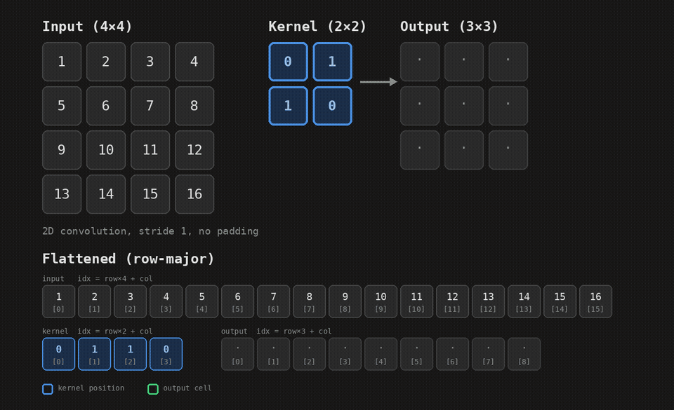

- read the article [A Gentle Introduction to CUDA PTX](https://philipfabianek.com/posts/cuda-ptx-introduction), indeed a really "gentle" introduction to PTX: it covers the basic instructions, where PTX fits in the CUDA compilation pipeline, and the cli commands to inspect and work with it. highly recommended. it also links to the [Inline PTX Assembly](https://docs.nvidia.com/cuda/inline-ptx-assembly/index.html) docs, which teach you how to inline PTX in your kernels. i'm not at that level of ninja yet, but soon ;)

- started chapter 3 of Programming Massively Parallel Processors. i've already picked up some of the chapter concepts by doing LeetGPU problems, but it's good to take a step back and revisit them properly.

### Day 12

- solved two more LeetGPU medium problems: [Count 2D Array Element](day12/count_2d_array_element.cu) and [Count 3D Array Element](day12/count_3d_array_element.cu). more indexing practice on top of day 10's reduction pattern.

- learned about warp-level primitives: threads in the same warp can read each other's registers with `__shfl_down_sync`, no shared memory needed. used it in a new version of [Reduce](day12/reduce_2.cu).

- learned about memory coalescing, how the gpu merges a warps loads into one request and fetches as few 128-byte segments as possible.

- learned about shared memory bank conflicts: shared memory `__shared__` is split into 32 banks, and when threads in a warp hit different words in the same bank the access becomes sequential, one thread at a time.

  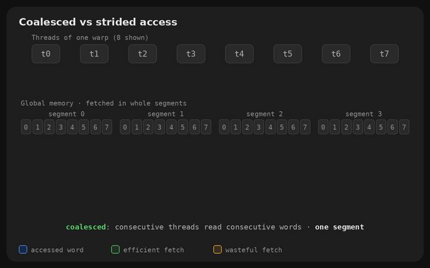


### Day 13

- solved another LeetGPU medium problem: [Prefix Sum](day13/prefix_sum.cu). the trickiest one so far... i was not able to solve it on my own, i watched the lectures Prefix Sum Scan [Part 1](https://www.youtube.com/watch?v=9CWDuPjUNHU&list=PLRRuQYjFhpmsjILcovwB7t1N_MmaU7sls) & [Part 2](https://www.youtube.com/watch?v=uARpJyWDcyY&list=PLRRuQYjFhpmsjILcovwB7t1N_MmaU7sls&index=2).

  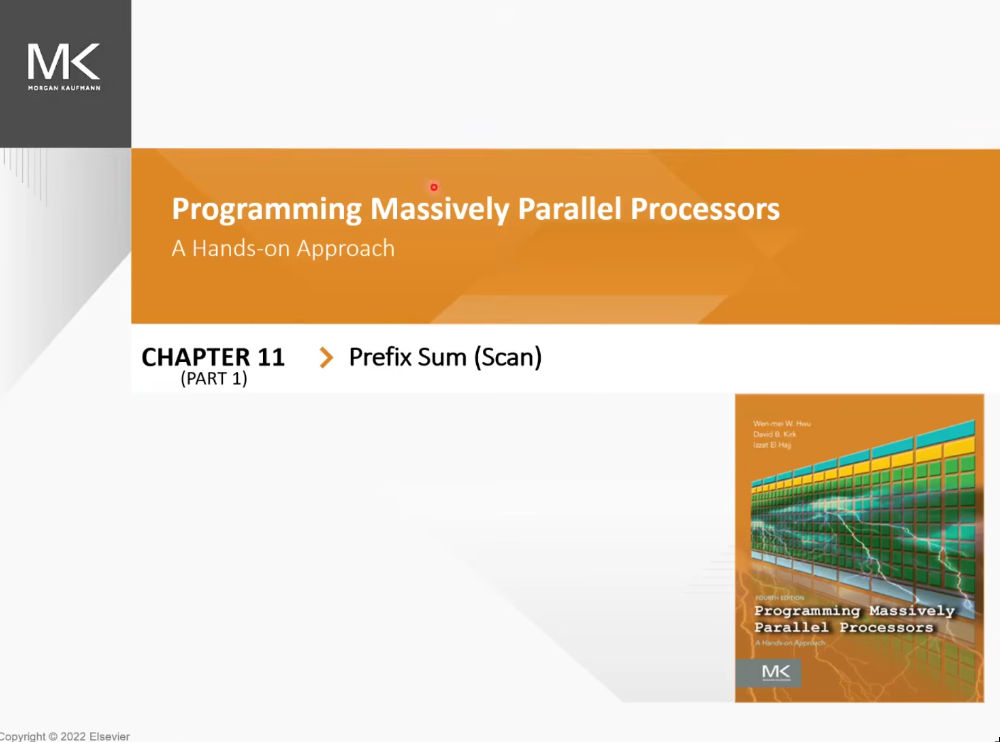
  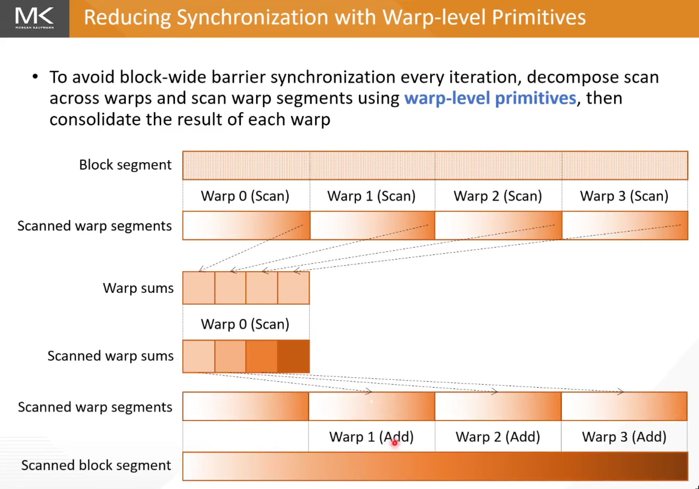

- til: 
  
  - the prefix sum is part of a problem family called "Scan". the name comes from the scan operator in Ken Iverson's APL (1962): https://en.wikipedia.org/wiki/APL_(programming_language)

  - many libraries implement scan operations: CUB -> `BlockScan` and `DeviceScan`, Thrust -> `inclusive_scan`, C++17 -> `std::inclusive_scan`, and MPI -> `MPI_Scan`.

### Day 14

- solved two more LeetGPU medium problems: [Softmax Attention](day14/softmax_attention.cu) and [GEMM (FP16)](day14/gemm.cu). 

- the GEMM (General matrix multiply) one is a naive implementation of matmul (for now), the problem requires to use `half` precision, but you need to make sure all calculations are done in `float` to avoid rounding errors.

- the softmax attention solution i came up with is 3 kernels: (1) the portion that multiplies the queries (Q) by the keys transpose (K^T), (2) the softmax part, and (3) finally a matmul with the values (V). technically i could have used the same matrix multiplication kernel for both 1 and 3, but then a memory allocation would be needed for K^T, so i decided to just keep those two separated.

  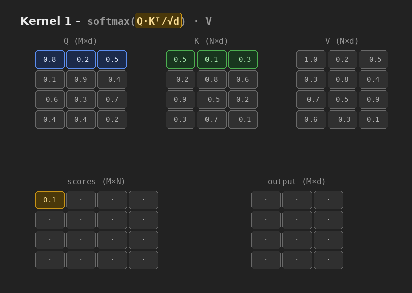

- finished chapter 3 of Programming Massively Parallel Processors, link to my notes: [chapter 3](docs/programming-massively-parallel-processors/chapter-3.md)

- started chapter 4. in the next few days i'll revisit some of my LeetGPU solutions and optimize them with what i've learned from the book.

### Day 15

- no new problems today, i revisited the LeetGPU GEMM problem. i wanted to improve the naive implementation from yesterday, and i found this blog post by Simon Boehm: [How to Optimize a CUDA Matmul Kernel for cuBLAS-like Performance: a Worklog](https://siboehm.com/articles/22/CUDA-MMM). 

- it's an excellent step-by-step guide, going from a naive GEMM kernel to something close to cuBLAS, explaining the decisions behind each optimization, highly recommended!

- i had the time to apply the first two optimizations from the article: [GEMM - Global Memory Coalescing](day15/gemm_2.cu) and [GEMM - Shared Memory Caching](day15/gemm_3.cu), which took the naive solution from 26 ms to 6.85 ms. still a long way to go... the top solutions in LeetGPU are in the 0.15 - 0.60 ms range.

- [GEMM - Naive](day14/gemm.cu):

  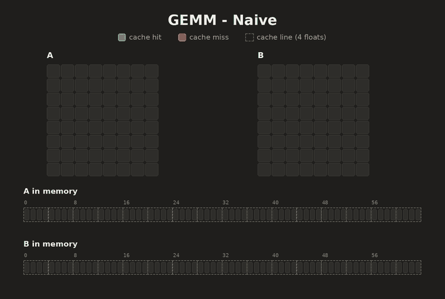

- [GEMM - Global Memory Coalescing](day15/gemm_2.cu):

  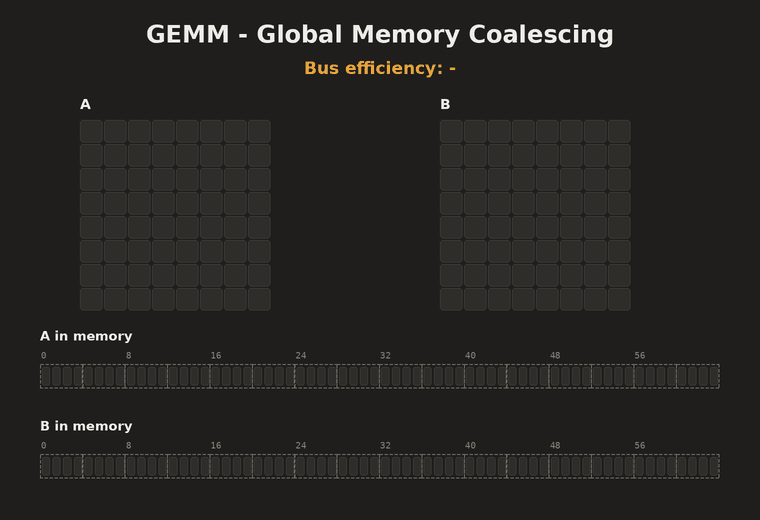


### Day 16

- solved another LeetGPU problem: [Subarray Sum](day16/subarray_sum.cu), the problem is interesting enough so i ended up implementing it in three different ways. the first approach calculates the prefix sum and uses the generated array to compute the answer. it is a bit of overkill, but it gives O(1) queries once the prefix sum array is pre-calculated with a kernel. the other two approaches are classical reductions, we just need to make sure any value we consider is within the range [S, E], otherwise we assign a 0 to the new input array.


- read a few more pages of Programming Massively Parallel Processors, almost done with chapter 4.

### Day 17

- solved the 2D version of yesterday's problem: 2D Subarray Sum, again with three implementations at different levels of optimization: [subarray_sum_2d](day17/subarray_sum_2d.cu), [subarray_sum_2d_2](day17/subarray_sum_2d_2.cu) and [subarray_sum_2d_3](day17/subarray_sum_2d_3.cu).

- finished chapter 4 of Programming Massively Parallel Processors, link to my notes: [chapter 4](docs/programming-massively-parallel-processors/chapter-4.md)

  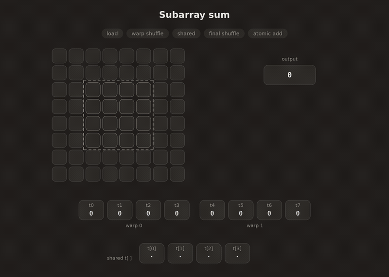

### Day 18

- solved the LeetGPU [Dot Product (FP16)](day18/fp16_dot_product.cu) problem and tried to optimize it as much as possible using warp shuffles and vectorized `float4` loads: [vectorized version](day18/fp16_dot_product_2.cu). 

- i'm still amazed by how much effort it takes to write a performant dot product. the end result is pretty much unreadable to someone with no CUDA experience. a few things make it feel "magical". for instance, `__shfl_down_sync` is really weird. it blows my mind that you can copy a value directly from another thread's register within the same warp. 

- it also takes a lot of effort not to mess up the indices once you start vectorizing with `float4`. using `half2` is easy to get wrong too, since accumulating in half precision can overflow, so i accumulated the results in `float` instead. it's not super hard, but it's easy to screw up.
