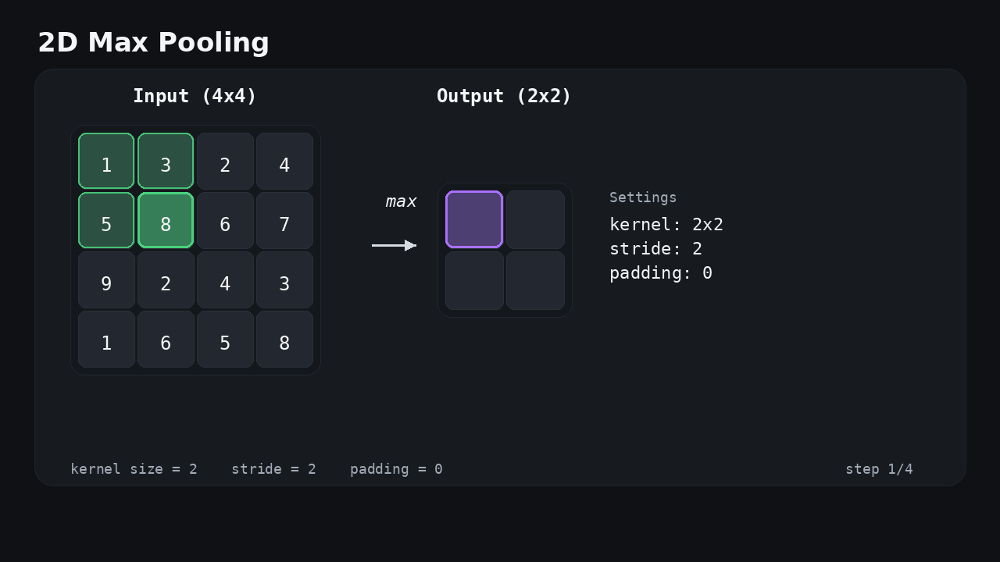

# 100 days of CUDA challenge

This is a 100-day challenge to master CUDA:

- https://github.com/hkproj/100-days-of-gpu/blob/main/CUDA.md

## Progress 

### Day 1

- learned that:
  - CUDA stands for **C**ompute **U**nified **D**evice **A**rchitecture.
  - the CUDA compiler is called NVCC (**N**VIDIA **C**UDA **C**ompiler).
  - CUDA is a platform with different levels of abstraction, either by language (e.g. python, c++, ptx) or by libraries. NVIDIA has put a ton of work into developing libraries to make developers' lives easier, for example:
    - **cuBLAS** linear algebra
    - **cuFFT** fast fourier transform
    - **cuDNN** neural networks
    - **cuRAND** random numbers

- found the NVIDIA [accelerated-computing-hub](https://github.com/NVIDIA/accelerated-computing-hub/tree/main) resource, plenty of courses to choose from, thinking of doing the Python ones.

- watched the video [What's CUDA All About Anyway?](https://www.nvidia.com/en-us/on-demand/session/gtc25-S72571/), a really great introduction to CUDA.

- created my first two CUDA kernels:
  - [hello_cuda.cu](day01/hello_cuda.cu)
  - [vector_addition.cu](day01/vector_addition.cu)


### Day 2

- learned about the CUDA execution hierarchy: grid -> block -> thread:
  

  ```c
  // blockDim.x = 4, blockDim.y = 3  → 12 threads per block
  dim3 block(4, 3);  
  // gridDim.x  = 2, gridDim.y  = 2  → 4 blocks 
  dim3 grid(2, 2);    
  // 48 threads total
  kernel<<<grid, block>>>();   
  ```

  ```c
  // 0 .. 7
  int col = blockIdx.x * blockDim.x + threadIdx.x;   
  // 0 .. 5
  int row = blockIdx.y * blockDim.y + threadIdx.y;   
  // 0 .. 47, unique
  // gridDim.x * blockDim.x is the total grid width in threads (8 here)
  int index = row * (gridDim.x * blockDim.x) + col; 
  ```

- grid limits in all three dimensions: 
x <= 2^32-1, y <= 65535, z <= 65535, if you do the math that is about 18.9 sextillion threads in total. which is pretty crazy number when you think about it... practical speaking in an RTX 5090 the max number of threads running at once is given by Num. SMs x 2048 around 348,160 threads, so is not like you can run all those threads :) 

- also block size limits in all three dimensions is as follow: x <= 1024, y <= 1024, z <= 64. important that x * y * z <= 1024, so the max number of threads per block is cap to 1024.

- looked into how CUDA compilation works: it separates the program into host and device paths.


- solved my first easy problem on LeetGPU, a matrix transpose kernel, hmm starting to understand the indices joggling of CUDA:
  - [matrix_transpose.cu](day01/matrix_transpose.cu)


### Day 3

- solved another easy LeetGPU problem, matmul, this one took longer than expected. the sequential version has three nested loops, in CUDA the two outer loops go to the threads, leaving only the inner dot-product loop. the tricky part is the array flattening part, really easy to mess up, i guess it gets better with practice.

  

  *Matrix multiplication: row of A · column of B.*

  

  *Same thing with flattened arrays.*

- since my matmul implementation is quite naive, i got curious about how this is done efficiently.  i found this great article, more fun for later :) 
  - https://siboehm.com/articles/22/CUDA-MMM

- ran across Flynn's taxonomy, nice for perspective, i knew SIMD from CPU land but never the full taxonomy: 
  - https://en.wikipedia.org/wiki/Flynn%27s_taxonomy

- also learned how the CUDA software model maps onto the actual hardware, nice mental model to keep in mind:


### Day 4

- learned a bit about warps:
  - the hardware splits each CUDA block into warps of 32 threads.
  - a warp is always (at least until now) 32 threads, even a block with a single thread takes up a full warp.
  - resources like shared memory are allocated per warp, not per thread.
  - all 32 threads execute the same instruction together at the same time, so if a conditional (like `if`) splits them into different paths, each path runs one after the other, that's warp divergence, and it's slow and not cool...

- solved three LeetGPU problems: [Color Inversion](day04/invert_rgb.cu), [RGB to Grayscale](day04/rgb_to_grayscale.cu) and [Reverse Array](day04/reverse_array.cu).

- the problems were mostly image transformations tasks. the images were given as a flatten array, for both problems once you extract the indices as follow, the calculations were easy.

  ```
  int channels = 4;
  int pixel = blockDim.x * blockIdx.x + threadIdx.x;
  if (pixel < width * height) {
    int idx = pixel * channels;
    ...
  }
  ```

- watched the video Unlocking GPU Performance with CUDA Tile:
  - highly recommended, really insightful Q&A session.
  - in short with cuTile we can program on tiles of data, the compiler handles the threads for you.
  - this is different than traditional SIMT, where the developer is in charge of the threads.
  - https://www.youtube.com/watch?v=uiIdk61UxEs
 

### Day 5

- optimized the LeetGPU problem matrix add with `float4` each thread now reads and writes 4 floats at once, so 4x fewer memory instructions 
  - [matrix_add_vec4.cu](day05/matrix_add_vec4.cu)

- solved the LeetGPU problems [1D Convolution](day05/convolution_1d.cu), [ReLU](day05/relu.cu) and [Leaky ReLU](day05/leaky_relu.cu).

- continued learning about warps:

- learned about branch efficiency, a simple metric for measuring warp divergence:

  ```
  branch efficiency = (num. branches - num. divergent branches) / (num. branches)
  ```
- during execution, warps pass through different states in the SM:
  - **active**: assigned to the SM, registers and memory allocated
  - **selected**: actively executing instructions
  - **stalled**: not ready to execute, waiting on something (memory load, barrier, etc.)
  - **eligible**: ready to execute, waiting for the scheduler

- here is the SM warp scheduler in action:

  

- read a bit about latency:

  

### Day 06

- solved the LeetGPU problems: [Rainbow Table](day06/rainbow_table.cu), [Copy Matrix](day06/copy_matrix.cu), [SiLU](day06/silu.cu), [SwiGLU](day06/swiglu.cu), [Value Clipping](day06/value_clipping.cu) and [Interleave Arrays](day06/interleave.cu). nearly done with all the easy problems. 

- did a few variants of [Copy Matrix](day06/copy_matrix_2.cu) and [Interleave Arrays](day06/interleave_2.cu) with vectorized loads/stores (`float4`, `float2`) to reduce the number of memory instructions.

- learned about the GPU memory hierarchy and the relative latency of each level. here is what it looks like on an H100:

  

  

- watched the video "Interview with NVIDIA CUDA Architect Stephen Jones", thanks to the youtube algorithm for this one. it's an informal discussion about CUDA, really helpful!

  - https://www.youtube.com/watch?v=dNUMNifgExs

- finally got the 5th Edition of Programming Massively Parallel Processors! took some time to deliver since it was not available on amazon.de and had to be ordered from the US. in the coming days i will go through the chapters and share my learnings:

  

### Day 07

- solved the LeetGPU problems: [GEGLU](day07/geglu.cu) and [Sigmoid](day07/sigmoid.cu). with this, all the LeetGPU easy problems are done! :)

- half way through the first chapter of Programming Massively Parallel Processors, taking notes along the way and will post them once i'm done. the book also has a youtube channel, worth a look:

  - https://www.youtube.com/@pmpp-book

- ran into the course "Heterogeneous Parallel Programming" by Prof. Wen-mei Hwu, one of the authors of the book. thinking of using it as supplementary material:

  - https://www.youtube.com/watch?v=kZy4JD8Z6KA&list=PLzn6LN6WhlN06hIOA_ge6SrgdeSiuf9Tb&index=1


### Day 08

- solved my first LeetGPU medium problem: [Reduction](day08/reduce.cu). this was a nice one, until now i was only doing transformations, where the output has the same number of elements as the input. reductions are a bit more tricky, all the threads have to cooperate to produce a single value. first time i actually needed `__shared__`, `__syncthreads()` and `atomicAdd`, here is an animation how the process actually looks:

  

- finished chapter 1 of Programming Massively Parallel Processors, my notes are here: [chapter 1](docs/programming-massively-parallel-processors/chapter-1.md)

- found another really nice CUDA course by Bob Crovella from NVIDIA, the explanations are excellent:

  - https://www.youtube.com/watch?v=OsK8YFHTtNs&list=PL6RdenZrxrw-zNX7uuGppWETdxt_JxdMj&index=1

### Day 09

- solved two more LeetGPU medium problems: [Dot Product](day09/dot_product.cu) and [Softmax](day09/softmax.cu).

- dot product was basically yesterday's Reduction problem again. 

- the softmax one was more interesting, i ended up using three kernels: global max (for avoiding overflow), sum of `exp(x - max)`, then the final calculation. 

  

- til: there's no `atomicMax` for floats, had to hack around it with `atomicCAS`, pretty ugly stuff... need to re-do the softmax at some point.

- started chapter 2 of Programming Massively Parallel Processors, should finish it tomorrow.

### Day 10

- solved two more LeetGPU medium problems: [Count Array Element](day10/count_array_element.cu) and [Mean Squared Error](day10/mse.cu). both are variations of the Reduction problem from day 8, this pattern is used in many problems. 

- finished chapter 2 of Programming Massively Parallel Processors.

### Day 11

- solved three more LeetGPU medium problems: [2D Convolution](day11/conv_2d.cu), [Gaussian Blur](day11/gaussian_blur.cu) and [Jacobi Stencil](day11/jacobi_stencil.cu). nothing super special about these, but they demand being extremely careful with the indices and boundary conditions. i'm starting to feel comfortable with row-major indexing. would like to try optimized versions of these later, currently my solutions are not optimized at all.

  

- read the article [A Gentle Introduction to CUDA PTX](https://philipfabianek.com/posts/cuda-ptx-introduction), indeed a really "gentle" introduction to PTX: it covers the basic instructions, where PTX fits in the CUDA compilation pipeline, and the cli commands to inspect and work with it. highly recommended. it also links to the [Inline PTX Assembly](https://docs.nvidia.com/cuda/inline-ptx-assembly/index.html) docs, which teach you how to inline PTX in your kernels. i'm not at that level of ninja yet, but soon ;)

- started chapter 3 of Programming Massively Parallel Processors. i've already picked up some of the chapter concepts by doing LeetGPU problems, but it's good to take a step back and revisit them properly.

### Day 12

- solved two more LeetGPU medium problems: [Count 2D Array Element](day12/count_2d_array_element.cu) and [Count 3D Array Element](day12/count_3d_array_element.cu). more indexing practice on top of day 10's reduction pattern.

- learned about warp-level primitives: threads in the same warp can read each other's registers with `__shfl_down_sync`, no shared memory needed. used it in a new version of [Reduce](day12/reduce_2.cu).

- learned about memory coalescing, how the gpu merges a warps loads into one request and fetches as few 128-byte segments as possible.

- learned about shared memory bank conflicts: shared memory `__shared__` is split into 32 banks, and when threads in a warp hit different words in the same bank the access becomes sequential, one thread at a time.

  


### Day 13

- solved another LeetGPU medium problem: [Prefix Sum](day13/prefix_sum.cu). the trickiest one so far... i was not able to solve it on my own, i watched the lectures Prefix Sum Scan [Part 1](https://www.youtube.com/watch?v=9CWDuPjUNHU&list=PLRRuQYjFhpmsjILcovwB7t1N_MmaU7sls) & [Part 2](https://www.youtube.com/watch?v=uARpJyWDcyY&list=PLRRuQYjFhpmsjILcovwB7t1N_MmaU7sls&index=2).

  
  

- til: 
  
  - the prefix sum is part of a problem family called "Scan". the name comes from the scan operator in Ken Iverson's APL (1962): https://en.wikipedia.org/wiki/APL_(programming_language)

  - many libraries implement scan operations: CUB -> `BlockScan` and `DeviceScan`, Thrust -> `inclusive_scan`, C++17 -> `std::inclusive_scan`, and MPI -> `MPI_Scan`.

### Day 14

- solved two more LeetGPU medium problems: [Softmax Attention](day14/softmax_attention.cu) and [GEMM (FP16)](day14/gemm.cu). 

- the GEMM (General matrix multiply) one is a naive implementation of matmul (for now), the problem requires to use `half` precision, but you need to make sure all calculations are done in `float` to avoid rounding errors.

- the softmax attention solution i came up with is 3 kernels: (1) the portion that multiplies the queries (Q) by the keys transpose (K^T), (2) the softmax part, and (3) finally a matmul with the values (V). technically i could have used the same matrix multiplication kernel for both 1 and 3, but then a memory allocation would be needed for K^T, so i decided to just keep those two separated.

  

- finished chapter 3 of Programming Massively Parallel Processors, link to my notes: [chapter 3](docs/programming-massively-parallel-processors/chapter-3.md)

- started chapter 4. in the next few days i'll revisit some of my LeetGPU solutions and optimize them with what i've learned from the book.

### Day 15

- no new problems today, i revisited the LeetGPU GEMM problem. i wanted to improve the naive implementation from yesterday, and i found this blog post by Simon Boehm: [How to Optimize a CUDA Matmul Kernel for cuBLAS-like Performance: a Worklog](https://siboehm.com/articles/22/CUDA-MMM). 

- it's an excellent step-by-step guide, going from a naive GEMM kernel to something close to cuBLAS, explaining the decisions behind each optimization, highly recommended!

- i had the time to apply the first two optimizations from the article: [GEMM - Global Memory Coalescing](day15/gemm_2.cu) and [GEMM - Shared Memory Caching](day15/gemm_3.cu), which took the naive solution from 26 ms to 6.85 ms. still a long way to go... the top solutions in LeetGPU are in the 0.15 - 0.60 ms range.

- [GEMM - Naive](day14/gemm.cu):

  

- [GEMM - Global Memory Coalescing](day15/gemm_2.cu):

  


### Day 16

- solved another LeetGPU problem: [Subarray Sum](day16/subarray_sum.cu), the problem is interesting enough so i ended up implementing it in three different ways. the first approach calculates the prefix sum and uses the generated array to compute the answer. it is a bit of overkill, but it gives O(1) queries once the prefix sum array is pre-calculated with a kernel. the other two approaches are classical reductions, we just need to make sure any value we consider is within the range [S, E], otherwise we assign a 0 to the new input array.


- read a few more pages of Programming Massively Parallel Processors, almost done with chapter 4.

### Day 17

- solved the 2D version of yesterday's problem: 2D Subarray Sum, again with three implementations at different levels of optimization: [subarray_sum_2d](day17/subarray_sum_2d.cu), [subarray_sum_2d_2](day17/subarray_sum_2d_2.cu) and [subarray_sum_2d_3](day17/subarray_sum_2d_3.cu).

- finished chapter 4 of Programming Massively Parallel Processors, link to my notes: [chapter 4](docs/programming-massively-parallel-processors/chapter-4.md)

  

### Day 18

- solved the LeetGPU [Dot Product (FP16)](day18/fp16_dot_product.cu) problem and tried to optimize it as much as possible using warp shuffles and vectorized `float4` loads: [vectorized version](day18/fp16_dot_product_2.cu). 

- i'm still amazed by how much effort it takes to write a performant dot product. the end result is pretty much unreadable to someone with no CUDA experience. a few things make it feel "magical". for instance, `__shfl_down_sync` is really weird. it blows my mind that you can copy a value directly from another thread's register in the same warp.

- it also takes some effort not to mess up the indices once you start vectorizing (`float4`, `half2`, ...). you have to read more data at a time, so your loop conditions change, and you also have to take care of boundary conditions because the data size is not always a multiple of the vector size.

### Day 19

- solved two more LeetGPU problems: [3D Subarray Sum](day19/subarray_sum_3d.cu) and [2D Max Pooling](day19/max_pooling_2d.cu). i need to revisit max pooling, my solution feels quite naive and probably has plenty of room for optimization.

- started chapter 5 of Programming Massively Parallel Processors. i should finish it tomorrow.

- found this amazing resource: [CUDA Operations Optimization Guides](https://www.rightnowai.co/guides/cuda-operations). it has lots of nice tutorials on CUDA kernel optimizations. it takes you from the naive solution to the optimized one.



### Day 20

- solved the LeetGPU [RMS Normalization](day20/rms_normalization.cu) problem. another reduction problem. i can see why reductions (or scans) are a must-have in any library that goals is to ease the implementation of kernels, these kinds of problems are everywhere, they are a fundamental building block.

- still reading chapter 5 of PMPP. today i came across the concept of computational intensity (FLOP/B) and how to determine whether a program is compute-bound or memory-bound.

### Day 21

- solved in two different ways the LeetGPU Cross Entropy Loss problem. the first one keeps the sum of the exp. in an additional array and then uses a warp reduction. the second solution avoids the extra memory by doing all the operations with warp shuffles. i learned about `__shfl_sync`, which allows threads within a warp to share register values, super useful for broadcasting a value to all threads in the warp. [cross_entropy_loss](day21/cross_entropy_loss.cu) and [cross_entropy_loss_2](day21/cross_entropy_loss_2.cu).

- finished chapter 5 of PMPP. there were so many learnings in this chapter. i think the main highlight is that GPUs gives you more control over memory than CPUs through the use of shared memory. on a CPU, you can only lay out your data access pattern, but you have no control over what enters the cache or not. also, for GPUs it's really important to keep an eye on how much register and shared memory your threads use. if this is above the average for the target hardware, you may run into occupancy issues because there aren't enough resources to allocate all 2048 threads in the SM. link to my notes: [chapter 5](docs/programming-massively-parallel-processors/chapter-5.md)


### Day 22

- solved the LeetGPU [3D Convolution](day22/conv_3d.cu) problem. this one is not too different from [2D Convolution](day11/conv_2d.cu), but it adds a depth dimension. so row-major indexes are given by the expression: 

  `(depth + d) * (input_rows * input_cols) + (row + r) * input_cols + (col + c)` 

- as usual with these kind of problems, you need to be really organized, it helps to have clear variables, otherwise it's easy to mess up.

- started chapter 6 of PMPP. this is a good one, the whole chapter is about optimizations techniques: memory coaslecing, loop unrolling, etc. 

- today i reached the top 100 on LeetGPU after solving 39/98 tasks. the remaining problems are not trivial, and i'll probably need to first master more parallel building blocks. in PMPP, those start in chapter 7 and include techniques such as histograms, filtering, merging, sorting, etc.

### Day 23

- solved the LeetGPU Histogramming problem in two ways. the [first](day23/histogramming.cu) is a naive solution that uses `atomicAdd` to update the histogram in global memory directly, this solution suffers of contention since all threads try to store the bin frequencies in the same global array, which is slow. the [second](day23/histogramming_2.cu) solution uses privatization, each block builds a private histogram in shared memory and then merges it into the global histogram, reducing contention and improving performance.

- still reading chapter 6 of PMPP.

### Day 24

- solved the LeetGPU Monte Carlo Integration problem in three slightly different ways. it is another reduction problem: we just need to sum all the sampled values and multiply the result by `(b - a) / n_samples`. 

- the [first](day24/monte_carlo_integration.cu) solution is a classical shared memory reduction, the [second](day24/monte_carlo_integration_2.cu) uses warp shuffles to skip one of the thread synchronizations (__syncthreads), and the [third](day24/monte_carlo_integration_3.cu) moves the final scaling step into a separate kernel so it is executed only once, thus minimizing the repeated instructions in each thread.

- still reading chapter 6 of PMPP, currently in section 6.6, today i learned a bit about thread coarsening, memory coalescing, bank conflicts and corner turning. 

### Day 25

- solved the LeetGPU Matrix Power problem. this was an interesting one for me because i had solved it sequentially for competitive programming contests. the approach is not too different this time, except the matmul itself runs in parallel with a CUDA kernel. one cool thing i learned back then is that this problem has an O(log P) solution, a trick that can be used for many surprising problems, like calculating Fibonacci numbers in O(log N) time. i found that super cool when i first encountered it. here is the fibonnaci matrix power, in case you're curious: https://algomaster.io/learn/dsa/matrix-exponentiation

- anyway... i implemented three versions: a [naive solution](day25/matrix_power.cu) with a not-so-optimized matmul, a [tiled matmul](day25/matrix_power_2.cu), and a [tiled version using the O(log P) trick](day25/matrix_power_3.cu). since P <= 20 the O(log P) does not help much, but for larger powers the performance improvement should start to show.

- finished chapter 6 of PMPP, link to my notes: [PMPP - Chapter 6](docs/programming-massively-parallel-processors/chapter-6.md)

### Day 26

- solved the LeetGPU [Attention with Linear Biases](day26/softmax_attention_linear_biases_2.cu) problem. ALiBi (Attention with Linear Biases) is a way to give a transformer information about where tokens are relative to each other without using traditional positional embeddings. the implementation is not too difficult: for each attention element `(i, j)`, we just need to compute `alpha * (i - j)` and add it to the current attention score. the term `alpha * (i - j)` is the linear position bias. in case you would like to learn more, here is the link to the paper: https://arxiv.org/pdf/2108.12409

- started chapter 7 of PMPP, the first chapter in part 2 of the book. this part focuses on parallel patterns, starting with convolutions, i can't wait to deep dive!

### Day 27

- solved the LeetGPU [Batched Matrix Multiplication](day27/batched_matmul.cu) problem. all the matmul problems so far were multiplying just two matrices, but in this case, we are given batches of matrices and have to store all the results in a row-major 1D array. a good guiding principle is to first try the stupidest solution that comes to mind, so that once the problem is solved, you can focus on optimizing it.

- ok, maybe it should be possible to run the matmul kernel once per batch, hmm but hold on, cowboy... the maximum number of batches is 128, and the kernel launch overhead may be significant (yeah, kernel launches are not free), which would probably make that solution quite slow.

- a better approach is to process the entire batch in a single kernel by treating the batch index as a sort of "depth" dimension. this is exactly what we did on Day 22 when solving the 3D Convolution problem. in this case, the indices for each matrix are given by the formulas:

  ```c
  A[batch * (M * K) + row * K + k]
  B[batch * (K * N) + k * N + col]
  C[batch * (M * N) + row * N + col]
  ```

- still reading chapter 7 of PMPP: convolutions.

### Day 28

- solved the LeetGPU [Rotary Positional Embeddings](day28/rope_3.cu) problem. RoPE gives transformers a sense of token order. it does this by rotating the query (Q) and key (K) vectors according to each token's position. you can learn more about RoPE here: https://arxiv.org/pdf/2104.09864.

- so at first, i thought i just needed to precompute `rotate_half` in a temporary array, thus transforming the problem into a simple element-wise calculation. however, the performance test uses `M = 1,048,576` and `D = 128`. creating a temporary array would add an unnecessary allocation and another pass over the data, not to mention the extra complexity.

- fortunately, none of that is needed. we can calculate `rotate_half` directly, one element at a time. for each output element, we find its rotated pair by checking whether `j` is in the first or second half of the row, then adding or subtracting `D / 2`. if `j` is in the first half, we also negate the current query value value:

  `rotHalf = j < halfD ? -Q[i * D + j + halfD] : Q[i * D + j - halfD]`

### Day 29

- solved the LeetGPU [Weight Dequantization](day29/weight_dequa.cu) problem. The idea of Weight Dequantization is to turn compact low precision weights (like int4 or int8) back into approximate versions of their original values (fp16 or fp32) using a scale matrix. this is useful for LLM inference, since quantized models use less GPU memory while keeping the weights "reasonably" close to the originals.

- this problem felt like it was misclassified. it should be an easy task, not a medium one. the problem already explains how to calculate the row and column, so the solution comes down to these two lines:

  ```
  int S_COLS = (N + TILE_SIZE - 1) / TILE_SIZE;
  Y[i * N + j] = X[i * N + j] * S[row * S_COLS + col];
  ```

### Day 30

- solved the LeetGPU [Causal Depthwise Conv1D](day30/causal_depthwise_conv1d_2.cu) problem. a causal depthwise 1D convolution gives a sequence model local context from the recent past. causal here means each output can only use the current and previous positions, never future ones, while depthwise means every feature channel (`D`) gets its own small convolution kernel.

- the key to these problems is learning how to translate the math into code. if you've been following my series, you'll recognize the same 3D row-major indexing pattern from days 22 and 27, this time with dimensions `B x L x D`. once that pattern becomes familiar, the translation is straightforward. solving lots of these problems helps make the indexing feel natural and effortless. in short... the solution comes down to these few lines (see below). note that i moved the `l - k >= 0` check into the loop condition. there is no reason to keep looping once `l - k` becomes negative because all remaining `x` input values are treated as zero, so they cannot change the sum.

  ```c
  float sum = bias[d];
  for (int k = 0; k < K && l - k >= 0; ++k) {
      sum += weight[d * K + k] * x[b * (L * D) + (l - k) * D + d];
  }
  output[b * (L * D) + l * D + d] = sum;
  ```

### Day 31

- solved the LeetGPU [SwiGLU MLP Block](day31/swiglu_mlp.cu) problem. SwiGLU is used in the MLP blocks of models like LLaMA and Mistral. in short, the SwiGLU MLP transforms each token's features independently, adding nonlinearities that helps the model to learn more complex patterns, the calculation looks like this:

  `output = (SiLU(X * W_gate) ⊙ (X * W_up)) * W_down`

- this problem has quite a few steps, so i kept the first version simple: one kernel per step and a few temporary buffers. definitely not optimized yet... i'll come back with a faster version soon. if you're curious, here is the paper: [GLU Variants Improve Transformer](http://arxiv.org/abs/2002.05202).

- i also started a new series called CUDA 101. i'm planning to create highly visual content to help others (and myself) learn CUDA. these posts will take a bit more effort and excalidraw-maxxing... but i'm having a lot of fun creating them!

### Day 32

- solved the LeetGPU [LoRA Linear](day32/lora_linear.cu) problem. LoRA (**L**ow-**R**ank **A**daptation) is a technique for fine-tuning large models more efficiently. instead of updating the original weight matrix `W`, it freezes it and learns two smaller matrices, `A` and `B`. the calculation looks like this:

  `output = xW^T + lora_scale * (xA^T) B^T`

- i followed the equation pretty much line by line: again there is plenty of room to optimize here, fuse kernels, more efficient matmul and remove temporary buffers. if you're curious, here is the LoRA paper: [LoRA: Low-Rank Adaptation of Large Language Models](https://arxiv.org/abs/2106.09685).

- i have a few LeetGPU solutions that need some serious optimization, so starting tomorrow, i'm taking a break from solving new problems to focus on improving some of the ones i've already solved.

- i'm almost done with chapter 7 of PMPP and should finish it today.


### Day 33

- no new problems today. i went back to optimize the solutions from the last two days. the [SwiGLU MLP Block](day33/swiglu_mlp_2.cu) dropped from 431.44 ms to 308.38 ms, while [LoRA Linear](day33/lora_linear_2.cu) went from 82.20 ms to 42.10 ms. the biggest win in both came from replacing the naive matmuls with tiled versions. this lets threads reuse the same values instead of fetching them from global memory over and over again.

- i also experimented with vectorized loads, but they did not improve the overall performance much. for SwiGLU's SiLU step, i tried the faster approximate exponential and division intrinsics:

  ```c
  z[i] *= __fdividef(1.0f, 1.0f + __expf(-z[i]));
  ```

  i compiled both versions and checked the PTX and SASS. the intrinsic version generated fewer instructions, but it still barely moved the overall runtime. the SiLU step is tiny compared with the three matmuls, so this was another nice reminder to optimize where the program actually spends its time... ;)

- here are the commands i used to inspect both compiler outputs. change `sm_120` to match your GPU's compute capability:

  ```bash
  # generate and print PTX
  nvcc -arch=sm_120 -O3 --ptx day33/swiglu_mlp_2.cu -o /tmp/swiglu.ptx
  less /tmp/swiglu.ptx

  # generate a cubin and disassemble it to SASS
  nvcc -arch=sm_120 -O3 --cubin day33/swiglu_mlp_2.cu -o /tmp/swiglu.cubin
  cuobjdump --dump-sass /tmp/swiglu.cubin | less
  ```

### Day 34

- solved the LeetGPU [Multi-Head Attention](day34/multi_head_attention.cu) problem. multi-head attention was introduced in the famous [Attention Is All You Need](https://arxiv.org/abs/1706.03762) paper.

- so for this one it really helps to write down each matrix operation and the shape of its output, we implemented attention on Day 29, but the multi-head thing add some "spiciness", which make it quite easy to mess up, i spent some time debugging the row major indices. the calculation looks like this:

  ```text
  d_k = d_model / h
  head_i = softmax(Q_i @ K_i^T / sqrt(d_k)) @ V_i   -> N x d_k
  output = Concat(head_1, ..., head_h)              -> N x d_model
  ```

- the solution uses three kernels: one for `Q @ K^T`, one for softmax, and one for multiplying the result by `V`. just like on Day 29, we avoid unnecessary allocations by reading `K` in transposed order instead of actually transposing it.

- wrote a new CUDA 101 post about `__syncthreads()` vs. `__syncwarp()`: https://x.com/pavelsimo/status/2090771328466812967?s=20

### Day 35

- solved the LeetGPU [Attention with Sinks](day35/attention_with_sinks.cu) problem. attention sinks are token positions that consistently receive much more attention than the rest, even when they contain little or no useful information. usually these sinks tend to emerge naturally in the first few tokens. in the paper [Efficient Streaming Language Models with Attention Sinks](https://arxiv.org/abs/2309.17453), the authors found that a sliding window stops working well once it moves past those first tokens. the fix is to choose a few of the first tokens as sinks and always include them in attention while the rest of the window moves forward.

- so the CUDA part is pretty much regular attention, except that we exclude parts of the score matrix before calculating softmax. each token can attend to the sink tokens and the recent tokens inside the sliding window, while the remaining positions are masked out (excluded). there are a couple of ways to do this: skip the excluded scores with an `if` condition, like i did in my solution, or set them to `-INF` so softmax turns them into zeros later on.
